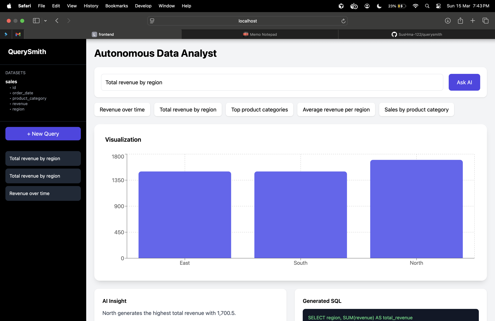
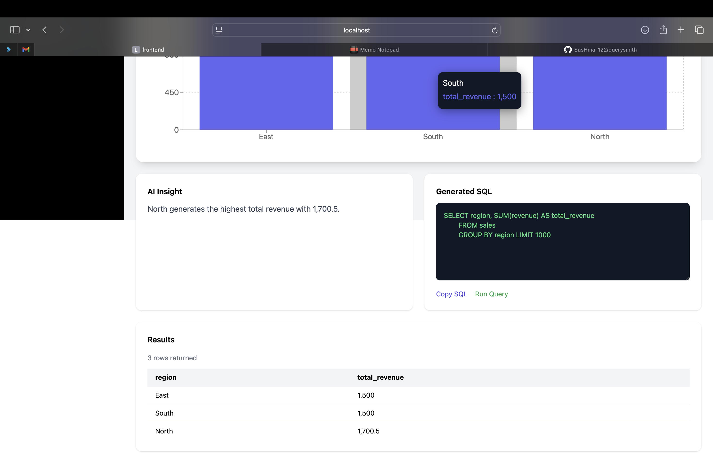
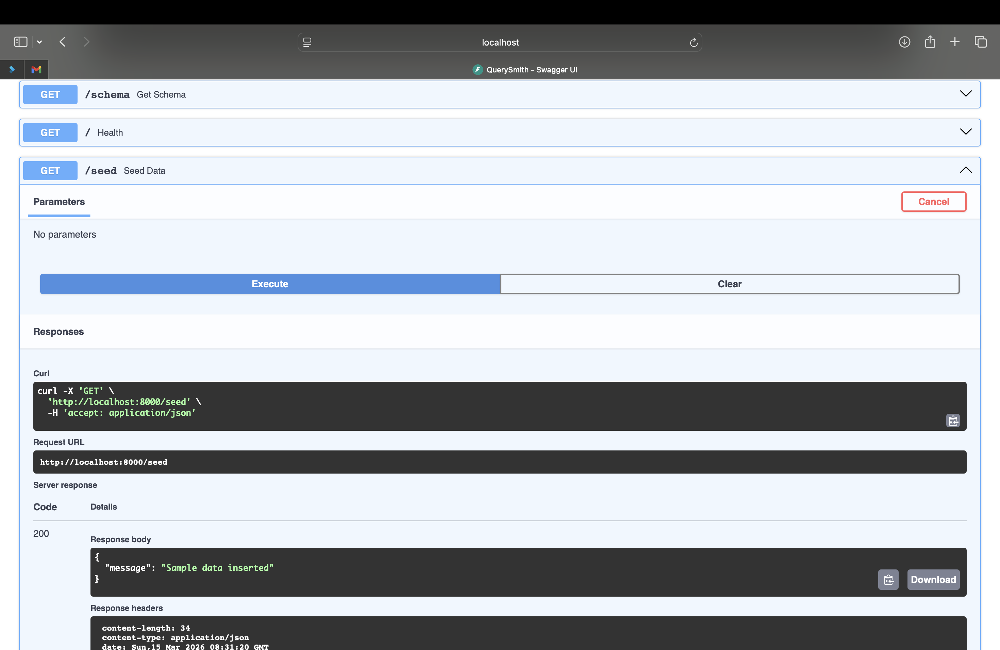
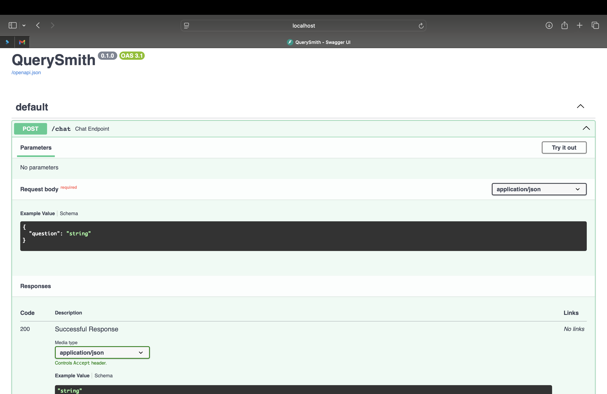

QuerySmith is an AI-powered application that converts natural language questions into SQL queries and generates insights from databases.

---

## Features

• Natural language → SQL query generation  
• AI-powered query understanding  
• Query result visualization  
• Clean full-stack architecture  

---

## Tech Stack

**Frontend**
- React
- Tailwind CSS

**Backend**
- Flask
- Python

**Database**
- SQL / SQLite / PostgreSQL

**AI Layer**
- Natural Language to SQL model

---

## System Architecture

User Question  
↓  
React Frontend  
↓  
Flask Backend API  
↓  
AI Query Generator  
↓  
SQL Database  
↓  
Visualization & Insights  

---

## Demo Screenshots

###frontend

###backend

## Running the Project

### Backend

cd backend  
pip install -r requirements.txt  
python app.py  

### Frontend

cd frontend  
npm install  
npm start  

---

## Author

Sushma Sai Palla